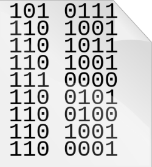
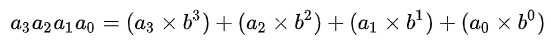

# Part1 进制转换
 1. 1分12秒 =  (72000)毫秒  
 2. (7A) 13 = (101 ) 10  
 3. (7A) 16 = (122) 10  
 4. (7A) 13 = (110 0101) 2 = (145) 8  
 5. (1011011) 2 = (133)  8 = (5B)  16  
 6. (678) 10 = (10 1010 0110)  2 = (1246)  8    
 7. (111) 2 + (101) 2 = (1100) 2  
      
# Part2
## 1) Information
Information is any entity or form that provides the answer to a question of some kind or resolves uncertainty. It is thus related to data and knowledge, as data represents values attributed to parameters, and knowledge signifies understanding of real things or abstract concepts.  
In the computer science, information is bits in context    
A sequence of bits in the following picture represents different information in different contexts.  
  

## 2) Positional notation
Positional notation or place-value notation is a method of representing or encoding numbers. Positional notation is distinguished from other notations (such as Roman numerals) for its use of the same symbol for the different orders of magnitude (for example, the "ones place", "tens place", "hundreds place"). This greatly simplified arithmetic, leading to the rapid spread of the notation across the world.  

In mathematical numeral systems the base or radix is usually the number of unique digits, including zero, that a positional
numeral system uses to represent numbers.  
In base-b, there are b digits and the number : 
    

## 3) Algorithm
In mathematics and computer science, an algorithm is an unambiguous specification of how to solve a class of problems. Algorithms can perform calculation, data processing and automated reasoning tasks.  

#### Algorithm has five features :  
1. **Finiteness**   
    The inferiority of the algorithm means that the algorithm must be able to terminate after performing a limited number of steps;
2. **Definiteness**  
    Each step of the algorithm must have an exact definition;
 
3. **Input**  
   An algorithm has zero or more inputs to characterize the initial condition of the operand. The so-called zero input means that the algorithm itself determines the initial condition;

4. **Output**  
    An algorithm has one or more outputs to reflect the results of processing the input data. An algorithm without output is meaningless;

5. **Effectiveness**  
    Each  step can be completed in a limited time (also known as validity).

## 4) Software bug  
A software bug is an error, flaw, failure or fault in a computer program or system that causes it to produce an incorrect or unexpected result, or to behave in unintended ways. The process of fixing bugs is termed "debugging".

 1 十进制: decimal

 2)二进制: binary   
  
 3)八进制: octonary
  
 4)十六进制: hexadecimal
