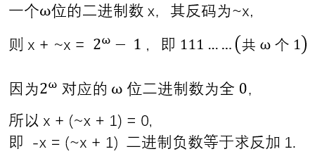
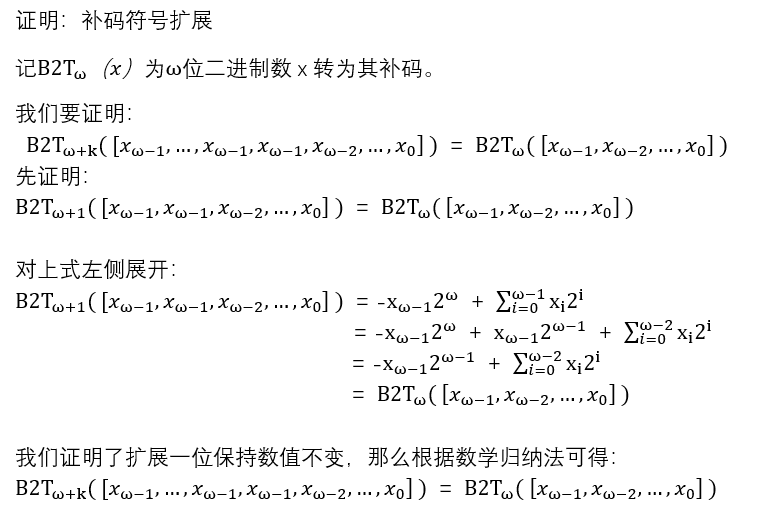
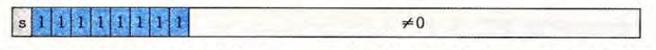

# Part 1
1 ) 
- int8_t x = 67 : 0100 0011
- int8_t y = -7 : 1111 1001
- int8_t z = y - z : 1011 0110

2 )
- int8_t x = 0xd3 :  1101 0011  `溢出`

3 )  
- uint8_t x = 0xd3 : 1101 0011

4 )
- int8_t x = 127 : 0111 1111 
- int8_t y = -7  : 1111 1001
- int8_t z = y - x : 0111 1010 `溢出`

5 )
float x = 1.125 : 1.001  

6 )  
float x = 23.0 : 1011.0

7 )  
float x = 0.45 : 0.0111 0011 0011 `出现精度误差`

# Part 2 

## 使用维基百科解释以下概念
1 ) Method of complements  
In mathematics and computing, the method of complements is a technique used to subtract one number from another using only addition of positive numbers. This method was commonly used in mechanical calculators and is still used in modern computers.  

2 ) Byte  
The byte is a unit of digital information that most commonly consists of eight bits, representing a binary number. Historically, the byte was the number of bits used to encode a single character of text in a computer and for this reason it is the smallest addressable unit of memory in many computer architectures.  

3 ) Integer (computer science)  
In computer science, an integer is a datum of integral data type, a data type that represents some range of mathematical integers. Integral data types may be of different sizes and may or may not be allowed to contain negative values. Integers are commonly represented in a computer as a group of binary digits (bits). The size of the grouping varies so the set of integer sizes available varies between different types of computers. Computer hardware, including virtual machines, nearly always provide a way to represent a processor register or memory address as an integer.  

4 ) Floating point  
In computing, floating-point arithmetic (FP) is arithmetic using formulaic representation of real numbers as an approximation so as to support a trade-off between range and precision. For this reason, floating-point computation is often found in systems which include very small and very large real numbers, which require fast processing times. A number is, in general, represented approximately to a fixed number of significant digits (the significand) and scaled using an exponent in some fixed base; the base for the scaling is normally two, ten, or sixteen.  

****

## 1)请证明：二进制的负数（two‘s complement of X）等于 X 的 ones’complement ＋ 1（即，X每位求反加1）

## 2)Int8_t x = - 017; 请用8进制描述变量 x。  
x = (361) 8

****

## 1)C程序：int8_t x = -0x1f; int y = x; 请用16进制描述变量 x 和 y，并说明 int y = x 的计算过程。
x = (E1) 16   
y = (FF FF FF E1) 16  
int y = x 是将x的二进制码1110 0001进行符号扩展成32位，  
 即 1111 1111 1111 1111 1111 1111 1110 0001

## 2)请用数学证明，为什么可以这么计算。

**** 

## 1) NaN 是什么？

IEEE 754 specifies a special value called "Not a Number" (NaN) to be returned as the result of certain "invalid" operations, such as 0/0, ∞×0, or sqrt(−1). In general, NaNs will be propagated i.e. most operations involving a NaN will result in a NaN, although functions that would give some defined result for any given floating-point value will do so for NaNs as well, e.g. NaN ^ 0 = 1. There are two kinds of NaNs: the default quiet NaNs and, optionally, signaling NaNs. A signaling NaN in any arithmetic operation (including numerical comparisons) will cause an "invalid" exception to be signaled.

The representation of NaNs specified by the standard has some unspecified bits that could be used to encode the type or source of error; but there is no standard for that encoding. In theory, signaling NaNs could be used by a runtime system to flag uninitialized variables, or extend the floating-point numbers with other special values without slowing down the computations with ordinary values, although such extensions are not common.