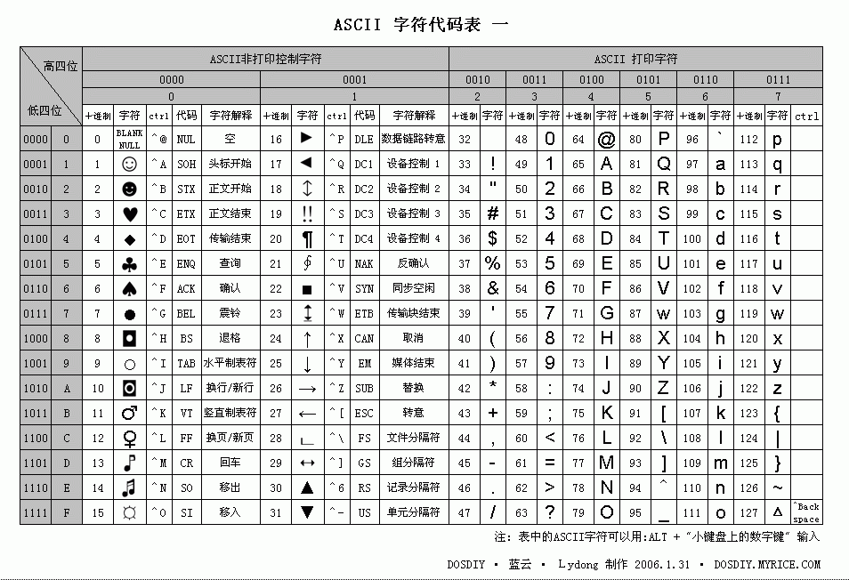
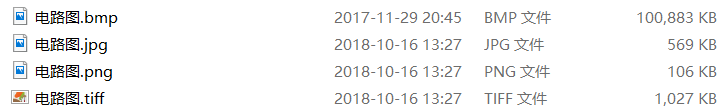

1. ASCII  
ASCII (/ˈæskiː/ (About this sound listen) ASS-kee), abbreviated from American Standard Code for Information Interchange, is a character encoding standard for electronic communication. ASCII codes represent text in computers, telecommunications equipment, and other devices. Most modern character-encoding schemes are based on ASCII, although they support many additional characters.

2. Color  
Color (American English) or colour (Commonwealth English) is the characteristic of human visual perception described through color categories, with names such as red, orange, yellow, green, blue, or purple. This perception of color derives from the stimulation of cone cells in the human eye by electromagnetic radiation in the visible spectrum. Color categories and physical specifications of color are associated with objects through the wavelength of the light that is reflected from them. This reflection is governed by the object's physical properties such as light absorption, emission spectra, etc.

****

1. 写出字符“A”,“中”的 ASCII 码、Unicode 码、utf-8 编码  
    ASCII: 0100 0001  
    Unicode: 100 0001  
    utf-8: 0100 0001

2. 黄色(yellow)的RGB编码是(255,255,0)

3.  从网上下载一个 BMP 格式图像,用图片编辑工具另存在 jpg、 png、tiff 格式。问三种格式中,哪种格式显示质量好?相对于BMP 格式,压缩率各是多少?  
  
tiff显示质量好  
jpg压缩率：569 / 100833 = 0.0056  
png压缩率：106 / 100833 = 0.0011  
tiff压缩率： 1027 / 100833 = 0.010  

4) Winrar压缩文件是lossless, or lossy 方法？  
   lossless
  