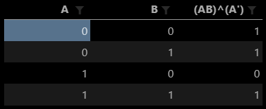

# hw05-Gates and Circuits

1. three representations of an AND gate:  
    1). A & B  
    2). A · B  
    3).    

    与门是一种当输入都为真(逻辑1)时，输出为真(逻辑1)的逻辑门电路。

2. three representations of an XOR gate  
    1.) A ^ B  
    2.) A ⊕ B  
    3.)   

    异或门是一种输入不同输出为真，输入相同输出为假的逻辑门电路。

3. Draw a circuit diagram corresponding to the following Boolean
   expression: (A + B)(B + C)  
    

4. (AB)^(A')  
    

5. circuit equivalence
    等效电路,在同样给定条件下，可代替另一电路且对外性能不变的电路。  
    证明：(AB)’ = A’ + B’
    

6. 8bit adder
      

7. Fill the follow expression  
    (1) (X8 X7 X6 X5 X4 X3 X2 X1)2 or (0000 1111)2 = (X8 X7 X6 X5 1 1 1 1 )2  
    (2) (X8 X7 X6 X5 X4 X3 X2 X1)2 xor (0000 1111)2 = (X8 X7 X6 X5  X4' X3' X2' X1')2  
    (3) ((X8 X7 X6 X5 X4 X3 X2 X1)2 and (1111 0000)2)   
    or (not (X8 X7 X6 X5 X4 X3 X2 X1)2 and (0000 1111)2)  
    = (X8 X7 X6 X5 X4' X3' X2' X1')2

## 使用维基百科，解释以下概念

1. Logic gate  
    In electronics, a logic gate is an idealized or physical device implementing a Boolean function; that is, it performs a logical operation on one or more binary inputs and produces a single binary output. Depending on the context, the term may refer to an ideal logic gate, one that has for instance zero rise time and unlimited fan-out, or it may refer to a non-ideal physical device.

2. Boolean algebra  
    In mathematics and mathematical logic, Boolean algebra is the branch of algebra in which the values of the variables are the truth values true and false, usually denoted 1 and 0 respectively. Instead of elementary algebra where the values of the variables are numbers, and the prime operations are addition and multiplication, the main operations of Boolean algebra are the conjunction and denoted as ∧, the disjunction or denoted as ∨, and the negation not denoted as ¬. It is thus a formalism for describing logical relations in the same way that elementary algebra describes numeric relations.
  
## 自学存储电路。维基百科：“Flip-flop”，选择中文：

1. Flip-flop 的中文是触发器

2. 能够存储1位二值信号