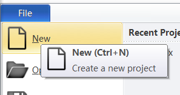
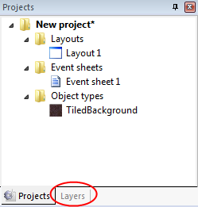

# 用Construct 2制作HTML5游戏
Construct 2是一款为开发2D游戏而设计软件。它不需要编码，任何人都可以开发游戏。  
初学Construct 2，我们将制作名为“幽灵射手”的HTML5游戏。游戏里玩家用方向键移动，点击鼠标左键对敌人展开射击。

## 1、准备开始
首先[安装Construct 2](https://www.scirra.com/construct2/releases/new)，Construct 2制作工具只支持Windows系统，不过你的游戏可以在任何平台运行。  
安装完成后运行，点击file->New,创建一个空项目。 
  
****
## 2、插入对象
### **`插入背景图片`**  
背景图片:  
  

现在，在layout画布里双击，弹出插入对象对话框。在该对话框中双击Tiled Background对象。
这时，鼠标指针形状变成了十字形，在布局的任何位置点击，弹出Texture editor对话框，我们把刚才保存的背景瓦片载入，关闭对话框。  
选中背景图片，在左边的Properties Bar属性面板里设置它的position位置为0,0（左上角），以及它的size大小为1280,1024（画布的大小）。  

### **`添加层`**  
接下来，我们来添加更多的对象。首先我们先去把背景瓦片对象锁定了，这样才不会被我们再次选中，和PS,FL里的锁定一样。

画布由多个层组成，我们可以在不同的层放置不同的对象，可以通过调整层的上下顺序来调整对象的前后显示，层可以被隐藏或者锁定，平滚特效等。背景瓦片放置于最底层，其他对象如玩家，怪物，NPC等放置在上面的几层。

我们可以通过Layers tab来管理层，和Project bar工程面板在一个选项卡中  
  