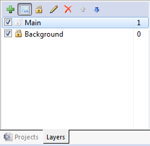

# 用Construct 2制作HTML5游戏

Construct 2是一款为开发2D游戏而设计软件。它不需要编码，任何人都可以开发游戏。  
初学Construct 2，我们将制作名为“幽灵射手”的HTML5游戏。游戏里玩家用方向键移动，点击鼠标左键对敌人展开射击。
****

## 1、准备开始

首先[安装Construct 2](https://www.scirra.com/construct2/releases/new)，Construct 2制作工具只支持Windows系统，不过你的游戏可以在任何平台运行。  
安装完成后运行，点击file->New,创建一个空项目。 
  
****

## 2、插入对象

### **`插入背景图片`**  

背景图片:  
  

现在，在layout画布里双击，弹出插入对象对话框。在该对话框中双击Tiled Background对象。
这时，鼠标指针形状变成了十字形，在布局的任何位置点击，弹出Texture editor对话框，我们把刚才保存的背景瓦片载入，关闭对话框。  
选中背景图片，在左边的Properties Bar属性面板里设置它的position位置为0,0（左上角），以及它的size大小为1280,1024（画布的大小）。  

### **`添加层`**  

接下来，我们来添加更多的对象。首先我们先去把背景瓦片对象锁定了，这样才不会被我们再次选中，和PS,FL里的锁定一样。

画布由多个层组成，我们可以在不同的层放置不同的对象，可以通过调整层的上下顺序来调整对象的前后显示，层可以被隐藏或者锁定，平滚特效等。背景瓦片放置于最底层，其他对象如玩家，怪物，NPC等放置在上面的几层。

我们可以通过Layers tab来管理层，和Project bar工程面板在一个选项卡中。点击Layers，将Layers0图层改名为Background。
并点击Background图层的锁图标锁定本图层。接着点击绿色的+号按钮添加一个新图层“Main”。  
  
  

### **`添加输入控制对象`**

回到画布中，同样双击插入另外一个对象，这次我们选择Mouse对象，我们需要鼠标输入控制。同样的添加Keyboard对象。  
**注意：这些对象不需要置于画布中，他们是隐藏的，自动在工程中起作用，现在工程中的所有层都可以使用鼠标和键盘输入控制了。**

### **`游戏对象`**

player  
  

monster  
  

bullet  
  

explode  

依次插入以上对象，方法如下：
1. 双击插入新对象  
2. 双击选择Sprite对象  
3. 当鼠标变成十字，在画布中点击  
4. 弹出对话框，点击open 图标，加载四张素材图片中的一张  
5. 保存并关闭对话框  
****

## 3、添加行为

我们给角色player添加8 direction movement行为：选中player，在properties bar属性面板里，找到Behaviors分类，点击Add/Edit弹出Behaviors行为对话框。在对话框中，点击+号添加行为图标，在弹出的“Add behavior”对话框中双击8 direction movement。 

以同样的方法添加更多的行为：
- 给player添加Scroll To和Bound to layout行为 
- 给Bullet对象添加Bullet movement和Destroy outside layout行为。
- 给Monster对象添加Bullet movement行为。
- 给Explosion对象添加Fade行为。Fade行为默认会销毁对象，所以不用担心对象有没有销毁。   

按住CTRL，拖拽Monster对象复制几个实例。他们都是Monster对象类型的。 

****

## 4、事件

接下来我们将通过Construct2的可视化编程——事件系统，添加自定义功能函数。  

首先打开事件编辑器面板。  
  

我们开始制作该事件。在event sheet的空白位置双击，将打开添加事件对话框：
  

不同的对象根据他们要做的行为拥有不同的条件和动作，在对话框中双击System对象，对话框中列出了所有System对象的条件,双击Every tick条件插入到事件表中。对话框将关闭，Every tick事件被创建，但没有actions(动作)。
  

接着我们添加一个动作来使角色看向鼠标。点击event右边的Add action链接，打开对话框,对话框中列出了可以添加动作的对象，双击player对象，对话框列出了player对象可添加的动作,选取Set angle towards position动作。该动作会自动计算角色到给定的X,Y坐标的角度。  
接下来要指定X,Y坐标值（动作的参数，条件同样可以带有参数）。我们输入Mouse.X和Mouse.Y
此时，运行就可以看到效果了。 

以同样的方法添加其它事件：  
- **让角色可以射击**  
条件：Mouse->On click->Left clicked(the default)  
动作：Player->Spawn another object->For Object，choose the Bullet  

- **爆炸特效**  
条件：Bullet->On collision with another object->pick Monster。  
动作：Monster->Destroy   
动作：Bullet->Spawn another object->Explosion，layer 1   
动作：Bullet->Destroy   

- **游戏开始时怪物向随机方向移动**  
条件：System->On start of Layout  
动作：Monster->Set angle->random(360)

- **怪物碰到边界时，朝玩家移动**  
条件：Monster->Is outside layout  
动作：Monster->Set angle toward position->For X，Player.X - for Y,Player.Y
****

## 5、实例变量

Instance variables允许每个怪物存储它自身的生命值。一个变量简化了说就是一个可以改变的值。他们单独存储，分别带他们相应的实例。
为monster添加实例变量health，使其初始值5,当怪物被子弹打到时，health减1，到0时消灭。  

**接下来要更改事件:**  
找到事件Bullet-on collision with Monster。现在的动作是destroy monster，右击该动作，选择Replace，选择Monster->Subtract from(in the Instance variables catrgory)->Instance variable "health",并输入值1。  
现在我们射击怪物时，当子弹碰到怪物，怪物生命值减1，子弹爆炸消失，但我们得添加一个事件来检测怪物的生命为0时，让它消灭。添加如下事件：  
条件：Monster->Compare instance variable->Health,Less or equal,0  
动作：Monster->Spawn another object->Explosion，layer1  
动作：Monster->Destroy  

下面是所有的事件：

*至此，运行游戏*
