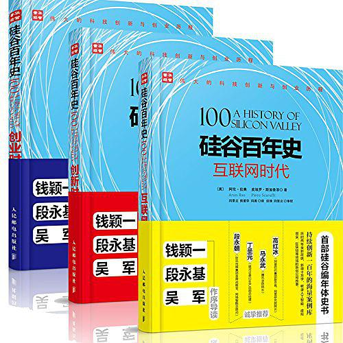
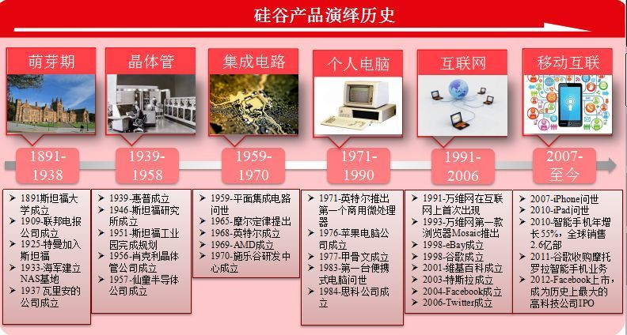

# 硅谷百年史

《硅谷百年史》是一部以旧金山湾区为中心、聚焦于计算机和生物科技产业、信息量巨大的编年史，详细讲述了“硅谷是什么，硅谷为什么，硅谷何以至此？”

## - 硅谷是什么？
> “硅谷以现有技术基础上予以改进为己任，而不是进行突破式创新，大部分创新都来自于其他地方。硅谷所起的作用，是使这些技术迅速传播。硅谷有着独特的、近乎魔鬼般的嗅觉，能迅速理解一项发明对于社会的可能的颠覆前景，并从中挣到大钱。”

## - 作者简介

阿伦·拉奥（Arun Rao），毕业于宾夕法尼亚大学沃顿商学院和加州大学洛杉矶分校安德森工商管理学院，长期从事投资业务，曾先后在三家投资公司工作，其中两家在硅谷。拉奥早期曾为《经济学人》（The Economist）和《Seeking Alpha》等杂志撰写商业和金融方面的文章。 

皮埃罗·斯加鲁菲（Piero Scarruffi ），毕业于意大利都灵大学数学系，1983年来到硅谷，在奥利维蒂公司任职工程师，长期从事人工智能研究和互联网设计。斯加鲁菲曾是斯坦福大学访问学者，还曾在加州大学伯克利分校讲学。20世纪90年代，他曾率先在互联网上开发自己的新闻网站，《纽约时报》曾经在2006年以《史上最伟大的网站》为题对其进行专题报道。斯加鲁菲现在是自由职业者，主要工作是为硅谷和欧洲的公司提供咨询以及在大学讲学。他兴趣广泛，在心智论、文学艺术、音乐史等领域多有著述。 

闫景立，毕业于哈尔滨工业大学电机系，美国俄克拉荷马大学访问学者，曾长期从事航空工程技术研究开发。自20世纪90年代初赴硅谷开办华为公司第一家海外分公司起，闫景立多年来在搭建中美高科技企业合作平台，拓展供应链、投资、市场和人才等方面做了大量开创性的工作。  

谈锋，毕业于北京大学、中国社会科学院研究生院，并在美国斯坦福大学做访问学者。目前担任北京中关村国家自主创新示范区驻美国硅谷联络处主任、国科火炬企业孵化器研究中心高级研究员。曾任北京中关村科技（控股）有限公司副总裁，北京四通集团 副总裁，《人民日报·海外版》主任编辑等。在硅谷工作生活了25年。曾参与翻译出版了《硅谷优势》、《朝鲜战争内幕》、《李普曼传》等书。 

作为中国高科技产业走向国际的开拓者，他们长期从事高科技公司管理、中美科技合作和创新、创业、人才研究工作，尤其是对硅谷创新生态环境的研究具有深刻的体验。他们亲身经历了硅谷过去二十年的繁荣和危机，不仅仅是目睹，他们也是这期间硅谷的历史变迁的参与者。 

## - 主要内容

&emsp;&emsp;硅谷，对于大部分IT工程师来说，是一个神秘、陌生，但又令人心生向往的地方。确实，数不清的创造发明从硅谷走出来，改变了人们的生活。那么，硅谷到底是一个什么样的地方？它为什么会成为IT领域的圣地？它的前世今生究竟是怎样的？《硅谷百年史》一书为我们带来了答案。  

&emsp;&emsp;《硅谷百年史》以编年体的顺序，详细地记述了从1900年到2013年在硅谷这片土地上所发生的重大的科技事件，读来让人心潮澎湃、热血沸腾。吴军老师为本书写了推荐序，他将硅谷成功的原因总结为先进的生产关系、宽松的创业环境和多元化的文化氛围三个方面。正如吴军老师所说，“对于一般的读者，想要快捷、直观地了解硅谷，一个不错的方法就是阅读《硅谷百年史》”。 

&emsp;&emsp;怀着一颗探秘的心，带着几分对硅谷的崇拜之情，我通读了《硅谷百年史》全书。在阅读的过程中，我时时能够感受到来自科技的强大力量和硅谷人渴望改变世界的决心。我认为，硅谷之所以能够成为世界的创新之都，真的是“天时地利人和”，是多方面的因素造就了它。我将硅谷成功的因素总结为：人、技术、资金和文化氛围四个方面。  

&emsp;&emsp;第一，人的因素。美国本身就是不同肤色人群的一个大熔炉，而这一点在硅谷表现得尤为明显。在硅谷，不仅有IT工程师、科学家、教授，还有律师、投资家等等。来自美国本土的人和外来的移民怀着一颗改变世界的心来到了硅谷，他们轻装上阵，因为“在这里，不必因为失败而背负污名”。此外，硅谷的几所世界顶尖大学，包括：斯坦福大学、加州大学伯克利分校、加州大学旧金山分校和圣何塞州立大学等，每年都为硅谷输送了成千上万的新鲜血液。新人和老人混在一起，为硅谷的成功奠定了智力基础。  

&emsp;&emsp;第二，技术的因素。如书中所说，硅谷虽然“并没有发明什么”，但它确实让很多的技术“迅速传播”，它起到了一个科技引擎的作用。硅谷虽然没有发明晶体管、集成电路、个人电脑、互联网、万维网浏览器、搜索引擎、社交网络和智能电话等，但它却拥有Intel、Apple、Google、Facebook等各个领域的王牌公司。它们各自以其精湛的技术和独特的商业模式改变了我们的生活。硅谷能够迅速理解一项技术发明的潜在价值，并用之改变世界。  

&emsp;&emsp;第三，资金的因素。“兵马未动，粮草先行”，对于一个创业者来说，钱尤为重要。要想建立伟大的企业，资金是不可或缺的一个条件。有美国的协会做过调查，全美最大的风险投资机构大都在硅谷。在2011年，硅谷的风险资金总额占全美风险资金总额的40%。另外，很多大公司的创始人在退休之后，也充当了投资人的角色。各种渠道的资金为创业者解决了后顾之忧，让他们甩掉了身上的沉重的包袱，能够用心做出与众不同的产品。  

&emsp;&emsp;第四，文化氛围的因素。在硅谷，大家都对失败者非常的宽容，认为“失败可以创造机会和更好的创新”。硅谷具有宽容失败的商业文化，因为只有善于从失败中学习的人，才能够成为优秀的企业家和管理者。在硅谷，不管是企业、学校，还是个人，都有一个改变世界的梦想，这个梦想激励着人们不断进步，去闯出一片属于自己的天地，纵使前进的道路上布满了荆棘也毫不畏惧。 

&emsp;&emsp;《硅谷百年史》将硅谷百余年的发展历程浓缩在一本四百多页的书中，可谓是字字珠玑，章章精彩，读来让人拍案叫绝。不管你是IT从业人员，还是IT技术爱好者，我都推荐你细细阅读《硅谷百年史》。  