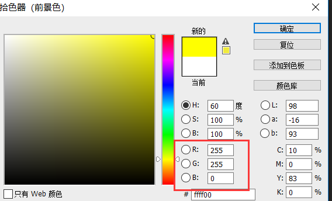
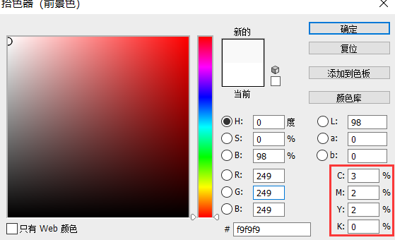
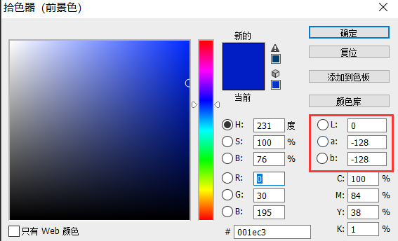
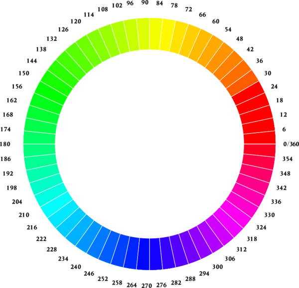

# 计算机颜色的表示模式

## 一、RGB颜色模式

又称RGB色空间，它是一种基于色光的表色模式。它广泛用于我们的生活中，如电视、计算机显示屏、幻灯片等都利用色光来呈色。

### 原理

RGB是从颜色发光的原理来设计定的，通俗点说它的颜色混合方式就好像有红、绿、蓝三盏灯，当它们的光相互叠合的时候，色彩相混，而亮度却等于两者亮度之总和，越混合亮度越高，即加法混合。  
红、绿、蓝三盏灯的叠加情况，中心三色最亮的叠加区为白色，加法混合的特点：越叠加越明亮。  
红、绿、蓝三个颜色通道每种色各分为256阶亮度，在0时“灯”最弱——是关掉的，而在255时“灯”最亮。当三色灰度数值相同时，产生不同灰度值的灰色调，即三色灰度都为0时，是最暗的黑色调；三色灰度都为255时，是最亮的白色调。  
RGB 颜色称为加成色，因为您通过将 R、G 和 B 添加在一起（即所有光线反射回眼睛）可产生白色。加成色用于照明光、电视和计算机显示器。例如，显示器通过红色、绿色和蓝色荧光粉发射光线产生颜色。绝大多数可视光谱都可表示为红、绿、蓝 (RGB) 三色光在不同比例和强度上的混合。这些颜色若发生重叠，则产生青、洋红和黄。

### 真彩

颜色深度为24位。计算机定义颜色时R、G、B三种成分的取值范围是0-255，这可以用24位二进制数表示，R、G、B每种颜色8位，可以组合出255 * 255 * 255=1670万种颜色。因此这红色绿色蓝色又称为三原色光，用英文表示就是R(red)、G(green)、B(blue)。R、G、B均为255时就合成了白光，R、G、B均为0时就合成了黑色。

### 高彩

与真彩类似，但颜色深度只有16位。

  
Photoshop中的RGB颜色模式，黄色为（255,255,0）

## 二、CMYK颜色模式

对从事印刷事业的人来说,CMYK是最熟悉不过了。这种模式是一种减色模式，遵循减色法混合规律。CMYK模式实质指的是再现颜色时印刷的C、M、Y、K的数值范围为0-100%。
（0%，0%，0%，0%）表示白色，（100%，100%，100%，100%）表示黑色。 

  
Photoshop中的CMKY颜色模式。

## 三、L\*A\*B颜色模式

它依照视觉唯一的原则，即在色彩空间内相同的移动量在眼镜看来造成彩色的改变感觉是一样的，是均匀色度空间。  
L\*A\*B颜色模式与设备无关，无论在显示设备、输出设备都提供一致的颜色，它解决了不同屏幕或不同打印机显示设备颜色不同的问题。
计算机表示颜色时，一般电脑中L的取值范围为0-100，A的范围为-128-127，B的范围为-128-127。  

  
Photoshop中的LAB颜色模式。  

## 四、HSB颜色模式

即色相、饱和度、亮度模式。它采用颜色的三属性来表色。饱和度和亮度以百分比表示，色相是以角度表示的。H从0-360度，即在色彩轮上，纯红定义为0度，黄色位于从红算起逆时针60度的地方，绿位于从红算起逆时针120度的地方。S用0-100%表示。灰色的S为0。S=100%则表示完全饱和，亮度B是指颜色亮暗关系，常用0-100%（由黑到白）的百分数表示。

   

色彩轮。
