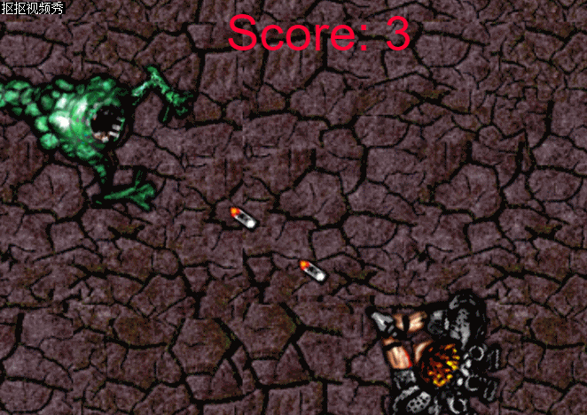

# “保卫家园”游戏设计与制作

## 一、游戏策划

**游戏名称**：保卫家园

**平台**：HTML5

**种类**：2D射击类游戏

**游戏背景**：一群外星人侵入地球，一个超级英雄站出来，使用枪击杀外星人，保卫家园。

**主要角色**：  

超级英雄     

 

外星人    

**游戏操作**：方向键以及鼠标控制超级英雄，点击鼠标左键射击。

**游戏规则**：每个外星人和超级英雄有若干生命值，击杀外星人积分+1；超级英雄碰到外星人生命值减少，在规定时间内存活下来则获得胜利，

## 二、游戏设计

### CRC CARD

## 对象行为

- 给超级英雄添加8 direction movement行为
- 给超级英雄添加Scroll To和Bound to layout行为 
- 给子弹对象添加Bullet movement和Destroy outside layout行为。
- 给外星人对象添加Bullet movement行为。
- 给Explosion对象添加Fade行为。Fade行为默认会销毁对象，所以不用担心对象有没有销毁。   

## 游戏事件

- **让角色可以射击**  
条件：Mouse->On click->Left clicked(the default)  
动作：Player->Spawn another object->For Object，choose the Bullet  

- **爆炸特效**  
条件：Bullet->On collision with another object->pick Monster。  
动作：Monster->Destroy   
动作：Bullet->Spawn another object->Explosion，layer 1   
动作：Bullet->Destroy   

- **游戏开始时怪物向随机方向移动**  
条件：System->On start of Layout  
动作：Monster->Set angle->random(360)

- **怪物碰到边界时，朝玩家移动**  
条件：Monster->Is outside layout  
动作：Monster->Set angle toward position->For X，Player.X - for Y,Player.Y

## 三、gif动画演示

