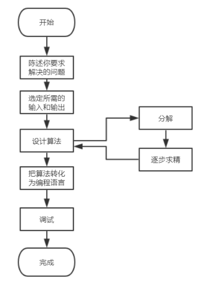
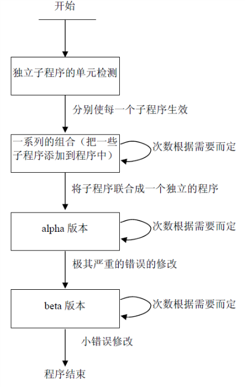

# “自顶向下，逐步求精”设计方法

假设你是在工厂工作的工程师，为了解决某些问题，你要编写一个程序。你如何开始呢？
当遇到一个新问题时，我们的心里会自然而然的产生这样的想法：马上坐在计算机前，开始
编程，而不用浪费大量的时间思考我们所要解决的问题是什么？用这种不切实际的想法来编
一些非常小的程序可能会成功。但在现实中，问题可能会非常的大，程序员再用这种方法编
程将会陷入困境。对于一个大的程序来说，在编写代码之前你要通盘的思考你所要面临的问
题和解决的方法。  
在此，我将向大家介绍的**自顶向下**的设计方法，对于我们所遇到一些简单的程序来说，这个方法好像有些画
蛇添足。但是当我们解决的问题变得越来越大的时侯，这个步骤将会变得异常重要。  
自顶向下设计是一种逐步求精的设计程序的过程和方法。对要完成的任务进行分解，
先对最高层次中的问题进行定义、设计、编程和测试，而将其中未解决的问题作为一个子任务放到下一层次中去解决。
这样逐层、逐个地进行定义、设计、编程和测试，直到所有层次上的问题均由实用程序来解决，
就能设计出具有层次结构的程序。自上而下的编程方法是我们正规编程设计的基础。
这种编程方法的步骤如下：  
    

### 1.清晰地陈述你所要解决的问题 

编写的程序大多数情况下要满足一些感觉上的需要，但这种需要不一定能够被人清晰地
表达出来。例如，用户需要一个控制洗衣机的程序。像这样的要求就不够清楚，程序员
就很难编出一个使他满意的程序。他必须弄清楚要有多少问题需要解决?他们必
须要对完成的任务有一个精确细致的描述。对问题清晰的描述可以防止误解，并且能够帮助
程序员合理的组织他的思想。

### 2.定义程序所需的输入量和程序所产生的输出量

指定输入量和输出量，只有这样新的程序才能适应全过程计划。在这个例子中输入可能是洗衣模式、注水量、洗衣时间等。
相似地，也需要产生出这个程序所要求的结果，即输出量。

### 3.设计你的程序得以实现的算法  

算法是指为某个问题找到答案一步接一步的程序。在这个阶段自上而下的编程方法发挥
了作用。编程设计者开始对这个问题进行逻辑划分，把它逐步分解为一个又一个子工作。这
个过程叫做分解(decomposition)。如果一些子工作还是比较大，设计者还可以把他它分解成
更小的块。这个过程将会继续到问题被分解成许多简单且易理解的小块为止。
在问题被分解成小块之后，每一个小块要被进一步的求精，这个过程叫做逐步求精
(stepwise refinement)。在这个过程中，设计者开始于对本小块代码总括性的描述，然后开始
一步一步地定义所需的函数，越来越具体，直到他能够转化为编程语言。逐步求精的
过程中，我们要用到的伪代码描述算法。  
在算法开发过程中，这个方法是非常有用的。如果设计者真正理解了解决问题这个些步
骤，他将会对问题进行分解和逐步求精。
假设洗衣机有一下基本操作
  ```c
  water_in_switch(open_close) // open 打开上水开关，close关闭
  water_out_switch(open_close) // open 打开排水开关，close关闭
  get_water_volume() //返回洗衣机内部水的高度
  motor_run(direction) // 电机转动。left左转，right右转，stop停
  time_counter() // 返回当前时间计数，以秒为单位
  halt(returncode) //停机，success 成功 failure 失败
  ```
正常洗衣的大致步骤： 
  
    1. 注水
    2. 浸泡
    3. 电机转动
    4. 排水
    5. 漂洗
    6. 脱水
    7. 结束 
  
### 4.把算法转化为代码

```c
water_in_switch(open)
while (get_water_volume()!=注水要求)  
water_in_switch(close)
for x minutes
    浸泡    

WHILE(电机启动)  
    motor_run(left)  
    motor_run(right)   
    时间-1   

water_out_switch(open)
while (水位!=0)  
water_out_switch(close)  
  
halt(returncode)
```
如果伪代码已经完成，那么所有程序员都会将伪代码一句一句地转化为合适的编程语言，比如C/C++。

### 5。调试产生的程序

这一步是真正的拦路虎。首先，程序的每一部分将会被单独地检测，如果有可能的话，
整个程序还要被检测一遍。在我们检测程序时，我们必须证明所有合法输入数据值都能够正常运行。用标准的输入值检测程序，看它是否产生了值。如果在一个程序中执行的算法包含了不同的分支，你必须检测每一个分支，以保证产生正确的答案。  

调试检测的过程如下：
  
