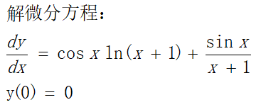
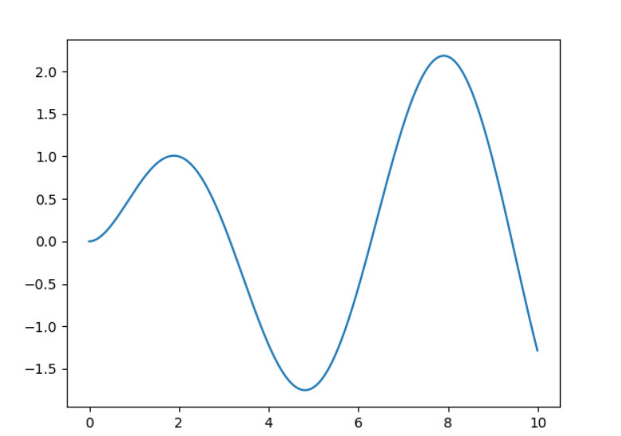
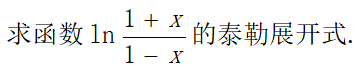
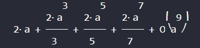
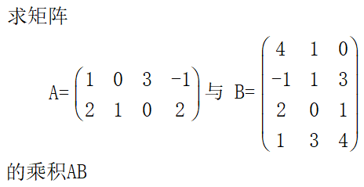
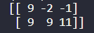
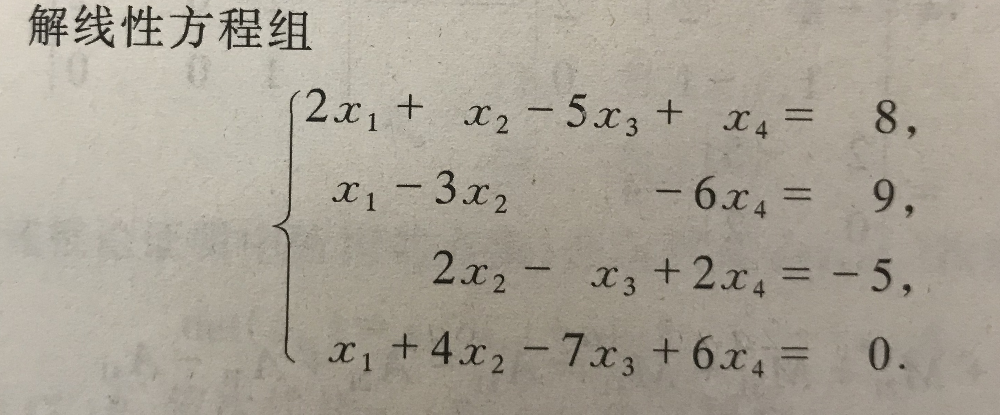

# python


## 高数题一



用python的Scipy库的odeint解微分方程。  
odeint(func,y0,t)  

参数：  
- func： callable(y,t) 返回微分方程形如dy/dt=f(y,t)的f(y,t)每一项的数组
- y0：   y的初始值
- t：   数组，自变量，时间点


```python
import math
from scipy.integrate import odeint
import numpy as np
from mpl_toolkits.mplot3d import Axes3D
import matplotlib.pyplot as plt 

def func(y, x):
    y = x
    return [math.cos(x)*math.log1p(x)+math.sin(x)/(x+1)]

t = np.arange(0, 10, 0.01)
track = odeint(func, (0), t)

#使用matplotlib画出y关于t的图像
plt.plot(t,track)
plt.show()

```

运行：


## 高数题二



```python
from sympy import *

x = Symbol('a')
exp = series(ln((1+x) / (1-x)),x,0,9)
pprint(exp)

```

运行：  


## 线性代数题一



```python
import numpy as np
A = np.array([[1, 0, 3, -1], [2, 1, 0, 2]])
B = np.array([[4, 1, 0], [-1, 1, 3], [2, 0, 1], [1, 3, 4]])
print(np.dot(A,B))
```
运行：  


## 线性代数题二



```python
import numpy as np
A = np.array([[2, 1, -5, 1], [1, -3, 0, -6], [0, 2, -1, 2], [1, 4, -7, 6]])
b = np.array([[8], [9], [-5], [0]])
print(np.linalg.solve(A,b))
```

运行输出:  
```
[[ 3.]
 [-4.]
 [-1.]
 [ 1.]]
 ```