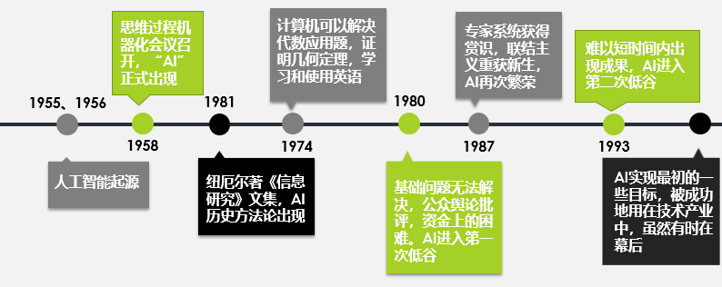
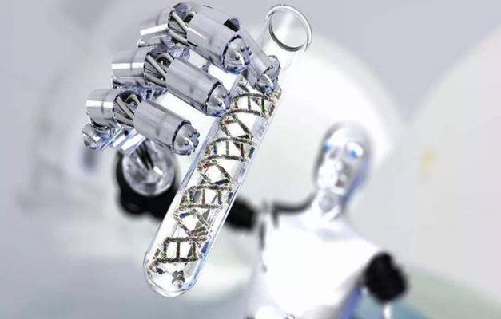

# 人工智能技术与伦理道德

## 人工智能的起源与发展

### 1955年，美国西部计算机联合大会

此次会议在洛杉矶召开，会中还另起一场小会：学习机讨论会。讨论会的参加者中有两个人参加了第二年的达特茅斯会议，分别是赛弗里奇（Oliver Selfridge）和纽厄尔（Allen Newell）。赛弗里奇发表了一篇模式识别的文章，而纽厄尔则探讨了计算机下棋。神经网络鼻祖之一皮茨（Walter Pitts）曾这么说：“他们一个企图模拟神经系统，另一个企图模拟心智……但实际上殊途同归。”这预示了几十年后人工智能关于“结构和功能”两个阶级、两条路线的斗争。

### 1956年，达特茅斯会议

与会者有会议的发起者达特茅斯学院的数学系助理教授麦卡锡（John McCarthy）、普林斯顿大学的数学博士明斯基（Minskey）、模式识别奠基人赛弗里奇、信息论的创始人香农（Claude Shannon）、符号派创始人纽厄尔和司马贺（Herbert Simon）等等，他们在接下来的数十年间是AI研究的领军人物。他们中有许多人预言，经过一代人的努力，与人类具有同等智能水平的机器将会出现。同时，上千万美元被投入到AI研究中，以期实现这一目标。

### 1974~1980年，人工智能进入第一次低谷
70年代，AI开始遭遇批评，随之而来的还有资金上的困难。AI研究者们对其课题的难度未能作出正确判断：此前的过于乐观使人们期望过高，当承诺无法兑现时，对AI的资助就缩减或取消了。同时，由于马文·闵斯基对感知器的激烈批评，联结主义（即神经网络）销声匿迹了十年。
70年代后期，尽管遭遇了公众的误解，AI在逻辑编程，常识推理等一些领域还是有所进展。

### 人工智能应用

人工智能市场在零售、交通运输 和自动化、制造业 及农业 等各行业垂直领域具有巨大的潜力。而驱动市场的主要因素，是人工智能技术在各种终端用户垂直领域的应用数量不断增加，尤其是改善对终端消费者服务。  

由于医疗保健行业大量使用大数据及人工智能，进而精准改善疾病诊断、医疗人员与患者之间人力的不平衡、降低医疗成本、促进跨行业合作关系。此外 AI 还广泛应用于临床试验、大型医疗计划、医疗谘询与宣传推广和销售开发。

 
来的时代的 AI 和 VR（虚拟现实），是缺一不可的VR常比喻成AI 的眼睛。那时为了机器人学习而创造的虚拟世界，本身就是虚拟现实技术的应用。还有，如果要让人进入到虚拟环境去对机器人进行训练，可能还需要更多其它的技术。  

# AI存在的问题

## 1.道德问题

应该使用谁的道德标准？ 

尽管有一份共同遵守的伦理原则的候选名单，但个人对这些原则的诠释往往有所不同。    

机器能谈论道德问题吗？   
尽管人们可能认同不同的道德标准，但他们往往通过讨论和辩论来解决这些分歧，或者有时通过与外部当事人进行接触。科技如何复制这种自由流动的对话，更重要的是，是否愿意接受和解呢？  

 算法能把上下文考虑进去吗？  
计算机是否能识别这种特定的信息，并对极其特殊的情况作出主观评价？  

能学习道德准则   
我们生来就有的价值观。所制造出来的计算机能够具有一种正直的观念吗？编程是否包含公平的理念？算法能学会尊重吗   

## 2.伦理问题

### 算法歧视
可能人们会说，算法是一种数学表达，是很客观的，不像人类那样有各种偏见、情绪，容易受外部因素影响，怎么会产生歧视呢？之前的一些研究表明，法官在饿着肚子的时候，倾向于对犯罪人比较严厉，判刑也比较重，所以人们常说，正义取决于法官有没有吃早餐。算法也正在带来类似的歧视问题。比如，一些图像识别软件之前还将黑人错误地标记为“黑猩猩”或者“猿猴”。此外，2016年3月，微软公司在美国的Twitter上上线的聊天机器人Tay在与网民互动过程中，成为了一个集性别歧视、种族歧视等于一身的“不良少女”。随着算法决策越来越多，类似的歧视也会越来越多。而且，算法歧视会带来危害。一方面，如果将算法应用在犯罪评估、信用贷款、雇佣评估等关切人身利益的场合，一旦产生歧视，必然危害个人权益。另一方面，深度学习是一个典型的“黑箱”算法，连设计者可能都不知道算法如何决策，要在系统中发现有没有存在歧视和歧视根源，在技术上是比较困难的。

### 隐私忧虑

很多AI系统，包括深度学习，都是大数据学习，需要大量的数据来训练学习算法。数据已经成了AI时代的“新石油”。这带来新的隐私忧虑。一方面，如果在深度学习过程中使用大量的敏感数据，这些数据可能会在后续被披露出去，对个人的隐私会产生影响。所以国外的AI研究人员已经在提倡如何在深度学习过程中保护个人隐私。另一方面，考虑到各种服务之间大量交易数据，数据流动不断频繁，数据成为新的流通物，可能削弱个人对其个人数据的控制和管理。当然，现在已经有一些可以利用的工具来在AI时代加强隐私保护，诸如经规划的隐私、默认的隐私、个人数据管理工具、匿名化、假名化、差别化隐私、决策矩阵等等都是在不断发展和完善的一些标准，值得在深度学习和AI产品设计中提倡。

### 机器人权利
即如何界定AI的人道主义待遇。随着自主智能机器人越来越强大，那么它们在人类社会到底应该扮演什么样的角色呢？自主智能机器人到底在法律上是什么？自然人？法人？动物？物？我们可以虐待、折磨或者杀死机器人吗？欧盟已经在考虑要不要赋予智能机器人“电子人”的法律人格，具有权利义务并对其行为负责。这个问题未来值得更多探讨。此外，越来越多的教育类、护理类、服务类的机器人在看护孩子、老人和病人，这些交互会对人的行为产生什么样的影响，需要得到进一步研究。

## 3.哲学审视

### 人工智能与人的意识的关系？

- 人的意识具有社会性，而人工智能则没有社会性。
- 人的意识具有能动的创造性，人工智能则没有创造性。
- 人工智能是用机械的、电子的装置来模拟人脑的部分功能，与人的意识有着本质区别。
- 人的意识的承担者是人脑，人工智能的承担者则是机械电子元件。

### 人工智能的自我意识

- 自我意识即意识到自我，意识到“我”是你一个独立的存在，与其他存在不同。
- 自在的人作为自然界的一种存在，与其他存在一样，是一种“自然而然”的存在。
- 人工智能能具有自我意识吗？从目前来看，答案是否定的。

